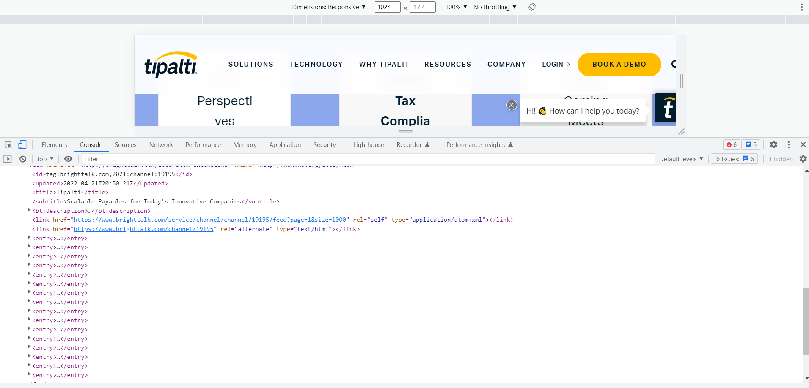

# BrightTALK-Integration

## Accomplished So Far:
* Set up dev enironment.
* Established ```fetch``` to BrightTALK.
* Successfully parsed the XML data.


## Future Steps:
 * Incorporate XML data into HTML div.
 * Style the section with XML data.


 ## Daily Screenshot
 * This image shows the XML parsed into the console.
   