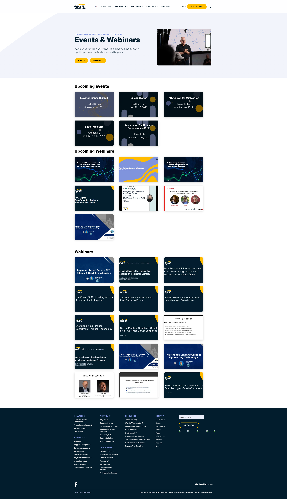

# BrightTALK-Integration

## Accomplished So Far:
* Set up dev enironment.
* Established ```fetch``` to BrightTALK.
* Successfully parsed the XML data.
* XML data required an XML function (```document.evaluate()```) to retrieve relevant     information from attributes (such as ```href``` values) found within the feed element. Successfully passed fetched and parsed XML data into ```evaluate()``` function to retrieve node information. 
* Found work-around for NS Resolver to direct XPath to correct node. Retrieved ```href``` values for ```links``` under ```entry``` node.
* Accessed all ```href``` values that are attributes of ```links``` descended from ```entries```.
* Created ```createVideoEl()``` function to render webinar links with correct thumbnail images.
* Created ```createContainerRow()``` function to target container tag and create a single row to emulate card functionality throught the rest of the Tipalti site. 
* Moved code to ```index.html``` file and integrated code with event-hub page. 
* Added btn to render six more webinar links with each click.
* Added 'Upcoming Webinars section'.
* Btns are hidden once there is no more content to render.


## Future Steps:
 * Make changes/updates if necessary.


 ## Daily Screenshot
 * Shows the upcoming and recorded webinars after all content has been rendered and btns are hidden. 

